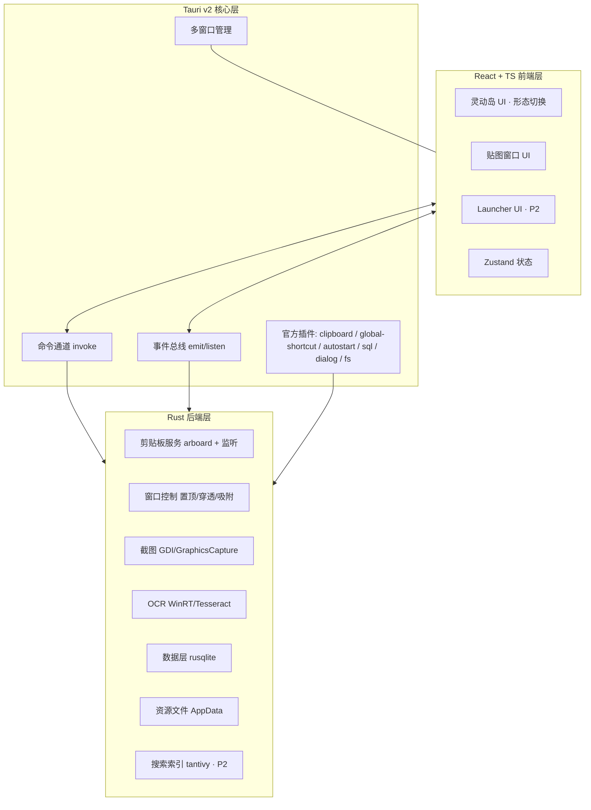
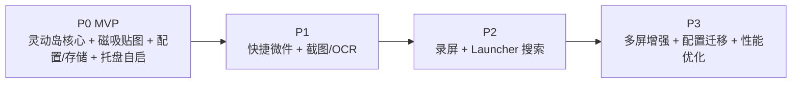
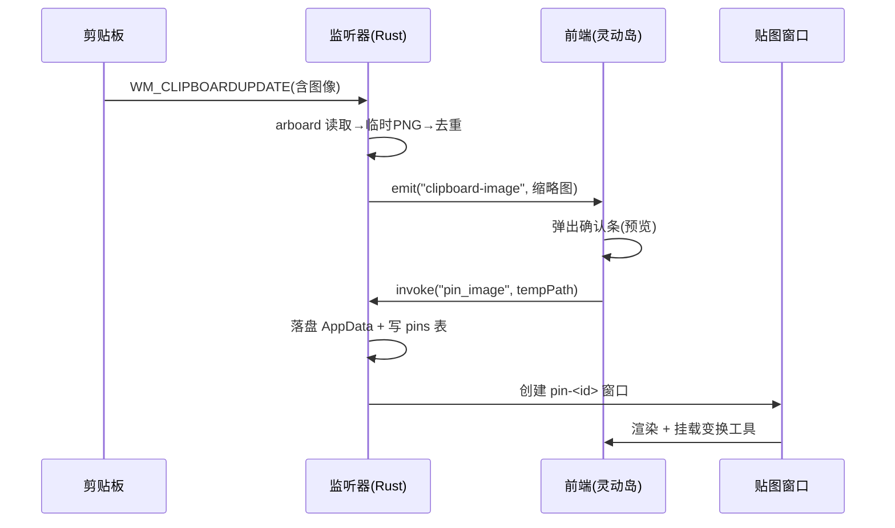

# 灵动岛桌面应用 — 需求拆解与方案

> 版本: v0.1 草案 · 日期: 2026-07-07 · 状态: 待审阅
> 技术基线: Tauri v2 + Rust 后端 + React + TypeScript 前端 · 目标平台: Windows 10/11

---

## 0. 文档目的与读者

本文档将粗稿中的功能构想拆解为**可执行的需求项**，并给出**技术方案**。采用「分阶段路线图 + MVP 详设」结构：

- 决策层可据此评估范围与里程碑；
- 开发者可据此直接进入实现计划阶段；
- 审阅人（你）据此核对方向是否正确，再决定是否进入实现。

---

## 1. 决策摘要（已确认）

| 决策项 | 结论 | 影响 |
|--------|------|------|
| 目标平台 | 仅 Windows 10/11 | 截图/录屏/剪贴板/窗口穿透统一走 Win32 / WinRT，不引入跨平台适配层 |
| 应用框架 | Tauri v2 | 多窗口、系统托盘、插件生态满足需求；包体小 |
| 前端 | React 18 + TypeScript | 动画生态（framer-motion）成熟，贴合灵动岛形变交互 |
| 状态管理 | Zustand | 轻量，适合多窗口共享状态 |
| 文档定位 | 分阶段路线图 + MVP 详设 | P0 写到需求/方案级，P1+ 写到方案概要级 |
| OCR 策略 | 本地优先，在线可选 | 默认 WinRT `Windows.Media.Ocr`，可配置在线 API 兜底 |

---

## 2. 项目概述

### 2.1 一句话定义
一个常驻 Windows 桌面顶部的「灵动岛」悬浮控件，集**状态展示、磁吸贴图、快捷微件、截图 OCR、录屏、本地搜索**于一体，所有数据本地化存储。

### 2.2 目标（Goals）
1. 提供 iPhone 灵动岛式的「胶囊 ↔ 展开」平滑形变交互，常驻置顶。
2. 剪贴板图片可一键「贴」到桌面，作为独立悬浮图层（缩放/旋转/透明度/拖拽）。
3. 岛内可承载快捷方式与动态微件（CPU、天气、未读数等）。
4. 内置截图、OCR、录屏、本地搜索等高频工具，减少工具切换。
5. 全量数据本地化，可加密导出迁移。

### 2.3 非目标（Non-Goals）
- 不做移动端。
- 不做云同步服务（仅本地导出/导入文件迁移）。
- MVP 不做录屏、Launcher、动态微件网络数据源。
- 不做 macOS/Linux 适配（远期再评估）。

### 2.4 用户画像
- 效率工具重度用户（Raycast/Alfred/Snipaste 受众）；
- 经常需要贴图对照参考的设计/前端/翻译工作者；
- 希望桌面常驻一个轻量状态栏的开发者。

---

## 3. 整体架构

### 3.1 分层架构



### 3.2 多窗口策略

灵动岛涉及「一个主控件 + N 个独立浮层」的形态，采用**多窗口**而非单窗口多 DOM 节点，原因：

- 每个贴图窗口可独立设置 `always_on_top` / z-order / 透明度 / 变换，互不干扰；
- 单窗口崩溃不波及其余；
- 性能隔离，窗口可按需销毁释放内存。

| 窗口 | label | 数量 | 职责 | 关键属性 |
|------|-------|------|------|----------|
| 灵动岛主窗口 | `island` | 1 | 胶囊/展开态、承载微件 | `transparent` `decorations:false` `always_on_top` `resizable` |
| 贴图窗口 | `pin-<id>` | N | 单张图片悬浮图层 | `transparent` `decorations:false` `always_on_top` 可拖拽缩放 |
| 截图选区窗口 | `snip` | 1（临时） | 全屏选区蒙层 | 全屏 `always_on_top` 截完即销毁 |
| Launcher 窗口 | `launcher` | 1（P2） | 搜索框 + 结果 | 居中 `always_on_top` 失焦自动隐藏 |

### 3.3 前后端通信约定
- **命令（invoke）**：前端主动请求数据/执行操作（读配置、创建贴图、截图）。
- **事件（emit/listen）**：后端主动通知（剪贴板新图、录屏帧就绪、外部拖入）。
- 所有系统级操作一律在 Rust 端执行，前端仅负责渲染与交互态。

---

## 4. 子系统拆解

将整体拆为 7 个相对独立的子系统，便于分阶段实现与独立测试：

| # | 子系统 | 职责 | 阶段 |
|---|--------|------|------|
| S1 | 灵动岛核心 | 形态切换、置顶穿透、边缘吸附、布局 | P0 |
| S2 | 磁吸贴图 | 剪贴板监听、贴图窗口、图层变换 | P0 |
| S3 | 配置与数据层 | SQLite、AppData 资源、配置读写、导出导入 | P0 |
| S4 | 系统集成 | 系统托盘、开机自启、全局快捷键 | P0 |
| S5 | 快捷微件 | 拖拽入岛、动态图标、数据源 | P1 |
| S6 | 截图与 OCR | 选区截图、本地 OCR、在线兜底 | P1 |
| S7 | 录屏 / Launcher | 无感录屏、本地全文搜索 | P2 |

> 多屏增强、性能深度优化、配置加密迁移归入 P3 横切项。

---

## 5. 分阶段路线图



| 阶段 | 范围 | 关键交付物 | 里程碑判据 |
|------|------|-----------|-----------|
| **P0 MVP** | S1/S2/S3/S4 | 可日常使用的状态岛 + 贴图 | 岛可形变/穿透/吸附；复制图片可贴；托盘自启可用 |
| **P1** | S5/S6 | 岛内动态微件 + 截图即贴即识别 | 拖文件入岛可用；截图→贴图→OCR 文本可复制 |
| **P2** | S7 | 录屏 + 全局搜索 | 录屏生成视频文件；快捷键呼出搜索可打开应用 |
| **P3** | 横切 | 多屏 / 迁移 / 性能 | 多显示器可选停靠；配置可加密导出导入 |

### 5.1 功能 × 阶段矩阵

| 功能点 | P0 | P1 | P2 | P3 |
|--------|:--:|:--:|:--:|:--:|
| 胶囊/展开形变 | ✅ | | | |
| 置顶穿透 + 悬停聚焦 | ✅ | | | |
| 边缘吸附（顶部居中） | ✅ | | | |
| 剪贴板图片监听 + 贴图 | ✅ | | | |
| 贴图缩放/旋转/透明度/拖拽 | ✅ | | | |
| SQLite + AppData 资源 | ✅ | | | |
| 系统托盘 + 开机自启 | ✅ | | | |
| 全局快捷键骨架 | ✅ | | | |
| 快捷方式拖拽入岛 | | ✅ | | |
| 动态微件（CPU/天气/未读数） | | ✅ | | |
| 选区截图 | | ✅ | | |
| 本地 OCR + 在线兜底 | | ✅ | | |
| 无感录屏 | | | ✅ | |
| Launcher 本地搜索 | | | ✅ | |
| 多屏停靠选择 | | | | ✅ |
| 配置加密导出/导入 | | | | ✅ |
| 内存池 / 虚拟列表优化 | | | | ✅ |

---

## 6. P0（MVP）详细需求与方案

### 6.1 S1 · 灵动岛核心

#### 6.1.1 需求项

| ID | 需求 | 验收标准 |
|----|------|----------|
| S1-1 | 胶囊态 | 默认显示为顶部居中胶囊，仅展示当前核心信息（如最近贴图缩略图 / 时钟 / 空状态提示） |
| S1-2 | 展开态 | 鼠标悬停或点击胶囊，平滑扩展为面板，展示分组图标/快捷入口；移出后延时收回 |
| S1-3 | 形变动画 | 胶囊↔展开切换平滑（framer-motion `layout` 动画），无闪烁、无白边 |
| S1-4 | 常驻置顶 | 始终置于所有窗口之上，不被遮挡 |
| S1-5 | 鼠标穿透 | 非交互区域鼠标可穿透点击下层窗口；悬停时自动获取焦点可点击 |
| S1-6 | 边缘吸附 | 默认吸附于主显示器顶部水平居中；可拖动改变横向位置，松手吸附到最近的顶部位置 |
| S1-7 | 记忆位置 | 关闭/重启后恢复上次位置 |

#### 6.1.2 技术方案

**窗口属性（Tauri v2 配置）**
```
island 窗口:
  transparent: true
  decorations: false
  alwaysOnTop: true
  resizable: false（形变由 setSize 控制内容尺寸，非用户拉伸）
  skipTaskbar: true
  shadow: false
```

**穿透 + 悬停聚焦机制（关键）**
- 默认调用 `setIgnoreCursorEvents(true, { forward: true })`：忽略点击，但 `forward:true` 使鼠标移动事件仍转发到前端。
- 前端监听 `mousemove`：判定鼠标进入胶囊命中区 → 调用 `setIgnoreCursorEvents(false)` 取消穿透，进入可交互态。
- 监听 `mouseleave` + 延时（~300ms）→ 恢复 `setIgnoreCursorEvents(true, { forward: true })`。
- 形变时通过 `invoke('set_window_size', {w,h})` 调整窗口尺寸匹配展开面板。

**形变动画**
- 前端用 framer-motion `layout` + `AnimatePresence` 做内容尺寸过渡；窗口尺寸跟随内容分步 `setSize`。
- 避免动画期间出现「内容大于窗口」被裁切：动画结束回调中校正窗口尺寸。

**边缘吸附**
- 启动/拖动结束时读取 `currentMonitor()` 获取显示器工作区，计算顶部居中坐标，`setPosition` 吸附。
- 拖动用自定义实现：监听鼠标按下→移动→松手，松手时吸附到 `y=顶部留白, x=居中或上次横向偏移`。

**位置记忆**
- 位置写入 `config` 表（横向偏移、显示器 id），启动时读取恢复。

---

### 6.2 S2 · 磁吸贴图

#### 6.2.1 需求项

| ID | 需求 | 验收标准 |
|----|------|----------|
| S2-1 | 剪贴板监听 | 系统剪贴板出现新图片时，灵动岛弹出「贴到桌面」确认条（含缩略图预览） |
| S2-2 | 一键贴图 | 点确认后图片作为独立悬浮窗口固定在桌面，默认出现在岛下方 |
| S2-3 | 图层变换 | 贴图支持：拖拽移动、滚轮缩放、旋转、透明度调节（0.2~1.0） |
| S2-4 | 置顶控制 | 每张贴图可单独切换「始终置顶 / 不置顶」 |
| S2-5 | 锁定 | 可锁定贴图（禁止移动/变换），防止误操作 |
| S2-6 | 关闭与恢复 | 关闭贴图窗口即移除；重启应用后可从「贴图历史」恢复已保存的贴图 |
| S2-7 | 多张贴图 | 支持同时多张贴图，各自独立变换与 z-order |

#### 6.2.2 技术方案

**剪贴板图片监听（Windows）**
- 用 `windows` crate 调 `AddClipboardFormatListener`，创建一个 message-only 隐藏窗口接收 `WM_CLIPBOARDUPDATE`。
- 收到事件后用 `arboard::Clipboard` 读取图片（DIB→转 PNG）。
- 去重：对比上一帧图像哈希（感知哈希或尺寸+部分像素），避免重复触发。
- 通过 `app.emit("clipboard-image", { tempPath, w, h })` 通知前端。

**贴图窗口生命周期**
```
前端确认贴图
 → invoke('pin_image', { srcTempPath })
 → Rust: 将图片落盘到 AppData/pins/<uuid>.png，写入 pins 表
 → Rust: 创建新窗口 pin-<uuid>（WebviewWindowBuilder），注入图片路径
 → 前端: 渲染贴图，挂载变换交互
```

**图层变换实现**
- 拖拽：贴图窗口整体 `setPosition`（跟随鼠标），或窗口内 CSS transform + 透明窗口。推荐窗口级 `setPosition`，保证跨窗口 z-order 正确。
- 缩放/旋转/透明度：窗口内 `` 用 CSS `transform: scale() rotate()` + `opacity`，窗口尺寸随之 `setSize`。
- 操作入口：贴图上悬停出现悬浮工具条（缩放滑块、旋转、透明度、置顶、锁定、关闭）。

**贴图历史与恢复**
- `pins` 表记录：id、文件相对路径、位置、缩放、旋转、透明度、置顶、锁定、创建时间、是否已关闭。
- 启动时查询 `pinned_open=1` 的记录，重建对应贴图窗口。

**剪贴板监听数据流**


---

### 6.3 S3 · 配置与数据层

#### 6.3.1 需求项

| ID | 需求 | 验收标准 |
|----|------|----------|
| S3-1 | 配置持久化 | 灵动岛位置、贴图列表、快捷键、显示偏好等持久化，重启恢复 |
| S3-2 | 资源外置 | 图片等大文件存于 AppData 目录，数据库只存路径，不存二进制 |
| S3-3 | 数据可靠 | 异常退出不丢配置；写入采用事务 |
| S3-4 | 导出导入 | P3 提供「备份到本地」导出加密 JSON/zip（含资源）；MVP 预留接口位 |

#### 6.3.2 技术方案

**存储选型**
- 数据库：`rusqlite`（SQLite，bundled feature 免系统依赖）。简单可靠，单文件。
- 资源目录：`appDataDir/pins/`、`appDataDir/screenshots/`（P1）、`appDataDir/recordings/`（P2）。
- 配置项：键值表 `config(key TEXT PK, value TEXT)` 存简单偏好；结构化数据走各业务表。

**目录结构**
```
AppData/Local/<AppName>/
  app.db                 # SQLite
  pins/<uuid>.png        # 贴图原图
  thumbs/<uuid>.webp     # 缩略图
  config.json            # 非敏感快速配置(可选,主存仍走DB)
  backups/               # 导出文件(P3)
```

**数据模型（MVP 表）**
```sql
-- 配置键值
CREATE TABLE config (
  key   TEXT PRIMARY KEY,
  value TEXT NOT NULL
);

-- 灵动岛位置/显示
-- 示例 key: island.pos_x, island.monitor_id, island.expanded_default

-- 贴图记录
CREATE TABLE pins (
  id           TEXT PRIMARY KEY,        -- uuid
  file_path    TEXT NOT NULL,           -- 相对 AppData 的路径
  thumb_path   TEXT,
  pos_x        REAL,
  pos_y        REAL,
  scale        REAL DEFAULT 1.0,
  rotation     REAL DEFAULT 0.0,
  opacity      REAL DEFAULT 1.0,
  always_on_top INTEGER DEFAULT 1,
  locked       INTEGER DEFAULT 0,
  pinned_open  INTEGER DEFAULT 1,       -- 是否当前展开(重启恢复用)
  created_at   INTEGER NOT NULL,
  updated_at   INTEGER NOT NULL
);

-- 快捷方式/微件分组(P1 占位,MVP 可不建)
CREATE TABLE groups (
  id    TEXT PRIMARY KEY,
  name  TEXT NOT NULL,
  sort  INTEGER NOT NULL
);
CREATE TABLE shortcuts (
  id        TEXT PRIMARY KEY,
  group_id  TEXT,
  type      TEXT NOT NULL,    -- app/url/widget
  label     TEXT,
  target    TEXT,             -- 路径/URL/widget类型
  sort      INTEGER,
  meta      TEXT              -- JSON: 微件配置
);
```

**写入策略**
- 所有写操作走事务；贴图落盘成功后再写库，失败回滚并清理临时文件。
- 启动时迁移/建表（版本号 `schema_version`，便于后续迁移）。

---

### 6.4 S4 · 系统集成

#### 6.4.1 需求项

| ID | 需求 | 验收标准 |
|----|------|----------|
| S4-1 | 系统托盘 | 提供托盘图标，右键菜单：显示/隐藏灵动岛、设置、退出 |
| S4-2 | 开机自启 | 可在设置中开关「开机自启」，开启后静默启动到托盘 |
| S4-3 | 全局快捷键 | 预留全局快捷键骨架（MVP 仅注册 1 个：切换灵动岛显隐） |
| S4-4 | 单实例 | 防止多开；二次启动时聚焦已有实例 |

#### 6.4.2 技术方案
- 托盘：Tauri v2 内置 `TrayIconBuilder` + `Menu`。
- 自启：`tauri-plugin-autostart`。
- 全局快捷键：`tauri-plugin-global-shortcut`（MVP 注册 `Alt+Space` 或可配置，切换岛显隐）。
- 单实例：`tauri-plugin-single-instance`，二次启动时 `show`+`setFocus` 主窗口。

---

## 7. P1 功能方案概要

### 7.1 S5 · 快捷方式微件化

**拖拽入岛**
- 灵动岛展开态作为放置目标，监听 Tauri 的文件拖放事件（`onDragDropEvent`）。
- 拖入 `.lnk`/`.exe`/URL/文件 → 解析为 shortcut 记录入库，岛内生成图标。
- 岛内图标点击 → `invoke('launch', { target })`，Rust 用 `ShellExecuteW` 打开。

**动态微件**
- 微件类型枚举：`clock`、`cpu`、`mem`、`weather`、`unread-mail`、`custom-api`。
- 数据采集在 Rust 端定时轮询（CPU/内存用 `sysinfo` crate；天气/邮件走 HTTP，需用户配置 API）。
- 通过事件推送到对应微件组件更新。
- MVP 不做，P1 先做 `cpu/mem/clock` 三个本地可采集的，网络类留 P1 后期。

### 7.2 S6 · 截图与 OCR

**选区截图**
- 触发：全局快捷键或岛内按钮。
- 流程：创建全屏 `snip` 窗口（无边框、置顶、半透明蒙层）→ 鼠标拖选矩形 → 松手后调用 Rust 截取该区域。
- 采集：Windows Graphics Capture API（`GraphicsCaptureItem` + `Direct3D11CaptureFramePool`）或 GDI `BitBlt` 兜底；输出 PNG。
- 截图后：可选「贴到桌面」走 S2 贴图流程 / 「识别文字」走 OCR / 「复制到剪贴板」。

**OCR**
- 本地优先：`Windows.Media.Ocr.OcrEngine`（WinRT，Win10+ 自带，需中文语言包）。无额外包体，速度快。
- 兜底：若系统未装中文语言包，回退 `tesseract-rs` + `chi_sim` 训练数据（增大包体，可选 feature）。
- 在线可选：设置中配置在线 API（如 Gemini Vision），对复杂版面/手写做高精度兜底。
- 结果：文本可复制、可一键贴为贴图、可发送到 Launcher 历史。

---

## 8. P2 功能方案概要

### 8.1 S7-a · 无感录屏
- 基于 Windows Graphics Capture（与截图同源），帧写入临时缓冲。
- 编码：内置/外挂 `ffmpeg`（推荐外挂，减小包体），输出 mp4/gif。
- 自动保存到 `AppData/recordings/`，记录入库；支持快捷键开始/停止/区域录屏。
- 难点：性能与磁盘占用，需限帧（如 15~30fps）与区域裁剪。

### 8.2 S7-b · Launcher 本地搜索
- 全局快捷键呼出 `launcher` 窗口（居中、失焦自动隐藏）。
- 索引来源：开始菜单 `.lnk`、自定应用目录、岛内快捷方式、贴图/截图历史、文件路径。
- 检索：`tantivy` 全文索引（中文需分词，如 `jieba-rs`）或 SQLite FTS5。
- 交互：输入即搜，回车打开，方向键导航。

---

## 9. P3 横切项

| 项 | 方案 |
|----|------|
| 多屏停靠 | 设置中选择灵动岛所在显示器（`availableMonitors`），位置随主屏切换可跟随 |
| 配置加密导出/导入 | 将 DB + 资源打包为 zip，密码加密（`age` 或 `aes-gcm`）；导入时校验版本与完整性 |
| 内存池/虚拟列表 | 岛内微件列表与贴图历史用虚拟列表；贴图窗口对象池化复用，避免频繁创建销毁 |
| 性能监控 | Rust 端暴露 `get_app_metrics` 命令，前端可显示内存/帧率用于自测 |

---

## 10. 技术栈与依赖清单

### 10.1 Tauri v2 官方插件
| 插件 | 用途 | 阶段 |
|------|------|------|
| `tauri-plugin-clipboard-manager` | 文本剪贴板（图片用自定义 Rust 命令） | P0 |
| `tauri-plugin-global-shortcut` | 全局快捷键 | P0 |
| `tauri-plugin-autostart` | 开机自启 | P0 |
| `tauri-plugin-single-instance` | 单实例 | P0 |
| `tauri-plugin-dialog` | 文件选择/保存 | P1+ |
| `tauri-plugin-fs` | 文件操作 | P0+ |
| `tauri-plugin-sql` | 备选数据层（我们用 rusqlite，可不用） | — |

### 10.2 Rust crate
| crate | 用途 | 阶段 |
|-------|------|------|
| `rusqlite` (bundled) | SQLite | P0 |
| `arboard` | 剪贴板图片读取 | P0 |
| `windows` | Win32/WinRT：剪贴板监听、Graphics Capture、Media.Ocr | P0/P1 |
| `sysinfo` | CPU/内存采集（微件） | P1 |
| `uuid` | 贴图/记录 id | P0 |
| `image` | 图片格式转换/缩略图 | P0 |
| `tesseract-rs` | OCR 兜底（可选 feature） | P1 |
| `tantivy` + `jieba-rs` | 全文搜索（P2） | P2 |

### 10.3 前端依赖
| 依赖 | 用途 |
|------|------|
| `react` / `react-dom` | UI |
| `typescript` | 类型 |
| `vite` | 构建 |
| `framer-motion` | 形变/过渡动画 |
| `zustand` | 状态管理 |
| `@tauri-apps/api` | Tauri 前端 API |
| `lucide-react` | 图标 |

---

## 11. 风险与待决项

| # | 风险/待决 | 影响 | 应对 |
|---|-----------|------|------|
| R1 | 透明窗口 + `setIgnoreCursorEvents` 在不同 Win 版本行为差异 | 穿透/悬停可能不灵 | 提前做兼容性验证；必要时改用极小不可见命中区轮询鼠标坐标 |
| R2 | 剪贴板监听 message-only 窗口在 Tauri 事件循环中的集成方式 | 监听不稳定 | 用独立线程 + channel 转发到 Tauri 主线程 emit |
| R3 | 多贴图窗口内存随数量增长 | 卡顿/泄漏 | 贴图数量软上限提示；窗口池化；缩略图懒加载 |
| R4 | Windows.Graphics.Capture 在部分环境（如 RDP）不可用 | 截图/录屏失效 | GDI BitBlt 兜底；录屏降级提示 |
| R5 | WinRT OCR 未装中文语言包时无中文识别 | OCR 不可用 | 检测语言包→提示安装 or 回退 tesseract |
| R6 | 形变动画窗口尺寸与内容尺寸不同步导致裁切/白边 | 视觉瑕疵 | 动画结束回调校正；过渡期给窗口额外 padding |
| R7 | 包体控制（tesseract 训练数据、ffmpeg） | 安装包过大 | 训练数据/ffmpeg 作为可选下载或 feature gate |
| D1 | 贴图是否支持「图层编组/层级调整」？ | 功能范围 | MVP 不做，P3 评估 |
| D2 | 微件数据源（天气/邮件）认证方式？ | 隐私与配置 | P1 后期再定，先做本地可采集微件 |
| D3 | 录屏是否需要声音/光标？ | 范围 | P2 实现时再定，默认不含声音 |

---

## 12. 验收与里程碑

### MVP（P0）验收清单
- [ ] 灵动岛常驻顶部居中，胶囊态显示空状态/最近贴图
- [ ] 悬停平滑展开为面板，移出延时收回
- [ ] 非交互区鼠标穿透可点击下层窗口；悬停可交互
- [ ] 可拖动改变横向位置，松手吸附顶部
- [ ] 复制图片后岛弹出确认条，确认后贴图为悬浮窗口
- [ ] 贴图可拖拽/缩放/旋转/调透明度/置顶/锁定/关闭
- [ ] 重启后位置与展开贴图自动恢复
- [ ] 系统托盘菜单可用，可开关开机自启
- [ ] 全局快捷键可切换岛显隐
- [ ] 单实例防多开

### 后续里程碑
- P1：截图→贴图→OCR 文本可复制；拖文件入岛生成可点击图标；CPU/内存微件实时刷新。
- P2：快捷键录屏生成 mp4；Launcher 可搜索并打开开始菜单应用。
- P3：多显示器可切换停靠屏；配置可加密导出并在另一台机器导入恢复。

---

## 13. 下一步

1. **你审阅本文档**，确认范围/阶段/技术选型是否正确，标注需调整项。
2. 审阅通过后，进入**实现计划（writing-plans）**阶段，针对 P0 MVP 拆出可执行任务清单与开发顺序。
3. P0 完成后再细化 P1 设计。
